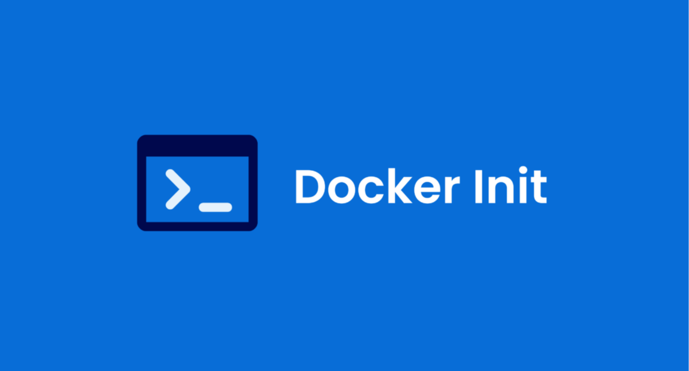
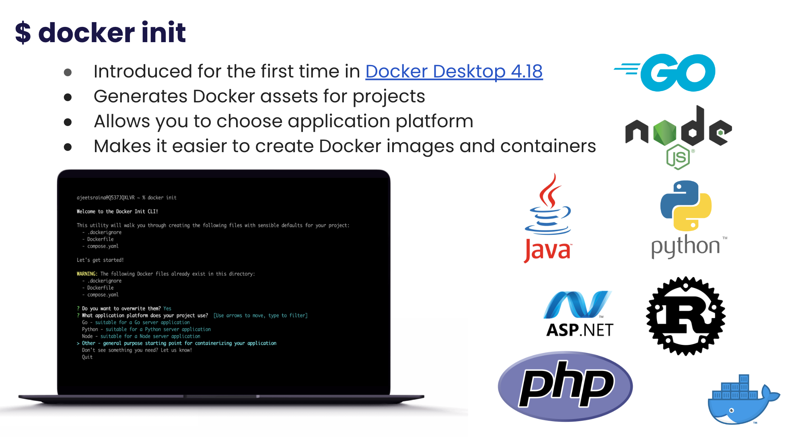

Introduced for the first time in Docker Desktop 4.18, the new docker init CLI generates Docker assets for projects, making it easier to create Docker images and containers. When you run the docker init command in your project directory, it will guide you through the creation of the necessary files for your project with sensible defaults. These files include:

```
.dockerignore
Dockerfile
docker-compose.yaml
```

The docker init command also allows you to choose the application platform that your project uses and the relative directory of your main package. 

## Who’s this for?

This feature is targeted at developers who want to quickly create and manage Docker assets without having to manually configure everything. 


## Benefits of Docker Init

The advantages of using the docker init command include:

- Simplified Docker asset creation: The command streamlines the creation of necessary Docker files, reducing the chances of errors and ensuring that best practices are followed.
- Saves time and effort: With the default settings and guided prompts, users can quickly create Docker assets without the need for extensive knowledge of Docker or its syntax.
- Better project organization: The generated files provide a standardized and organized structure for the project, making it easier for developers to maintain and update the project over time.
- Enhanced portability: By using Docker assets, projects become more portable across different environments, making it easier to move the project from development to production.




## Getting Started

- Install the latest version of Docker Desktop
- Install Node on your system

> Note:
> You must download and install the Node pre-built installer on your local system to get the `npm install` command to work seamlessly. [Click here to download](https://nodejs.org/en/download/)

### Clone the repository

```
git clone https://github.com/dockersamples/docker-init-demos
cd docker-init-demos/node
```

The usual way to bring up this node application is to follow the steps:

```
npm install
node app.js
```
You can verify the output by accessing the URL:


```
curl localhost:8080
```

Now let's see how to containerise this project using the `docker init` CLI.


### Run the following command:

```bash
 docker init
```

This utility will walk you through creating the following files with sensible defaults for your project:
  - .dockerignore
  - Dockerfile
  - docker-compose.yaml


### Install the Dependencies

```
npm install
```
 
### Running the container service
 
 ```
  docker compose up -d --build
 ```
### Accessing the Node app
 
```
 curl localhost:8080      .
/"""""""""""""""""\___/ ===
{                       /  ===-
\______ O           __/
 \    \         __/
  \____\_______/


Hello from Docker
```
